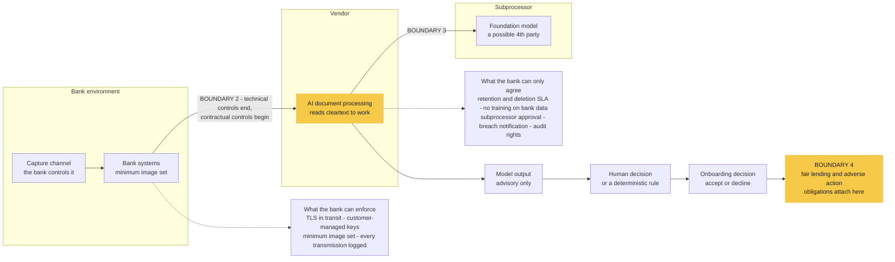
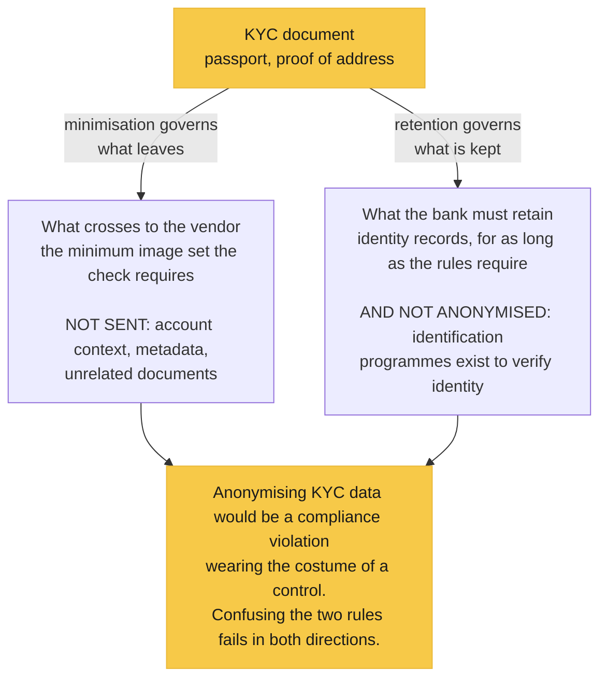

# Design Case 2: Approving an AI Vendor for KYC Without Losing the PII

*Part of [The decisions](../decisions.md). Rendered version on [my site](https://bigbadlonewolf.github.io/Lanreoluokun.com/design-cases/case-2-ai-vendor-kyc/).*

## The scenario

The same bank, six months later. The onboarding team wants a third-party AI document-processing service for KYC: passports, utility bills, proof of address. Compliance is worried about a vendor touching customer PII and a model nobody inside the bank controls or can inspect. Leadership wants a decision and a design in 60 days.

## The decision, sentence one

**Approve, with conditions, and the conditions are the design.** Defined PII protection. Retention and deletion after processing. No training on bank data. Subprocessor disclosure and approval. Breach notification inside the regulatory window. Continuous audit rights.

If the vendor will not sign those, the recommendation flips to reject. A condition with no consequence attached is a wish. The willingness to say no is the only thing that makes the yes credible.

## Scope

**In:** the complete lifecycle of the KYC document and the vendor's output. Capture in the bank's channels, transmission to the vendor, processing on vendor infrastructure, retention and deletion on both sides, and the onboarding decision path the model's verdict feeds.

**Out:** rebuilding the onboarding workflow. Any use of this vendor beyond KYC documents. Expansion is a future decision with its own assessment, not a rider on this one.

## Constraints

- **60 days.** Due diligence runs in parallel with the design, not before it.
- **Onboarding latency budget.** The check sits inside the customer acquisition path. Added friction breaks conversion.
- **Black-box model.** Internals cannot be inspected, so the design cannot rest on understanding the model. It has to bound what the model can see and what its output is allowed to do.
- **Unknown training data.** Provenance and bias questions cannot be answered directly. They get bounded contractually and monitored empirically.
- **Political reality.** Leadership already wants this vendor. The job is to make yes safe, not to say no from the sidelines.

## Trust boundaries

1. **Capture channel to bank environment.** Standard. The bank controls it.
2. **Bank to vendor.** The decisive one. The vendor has to read cleartext documents in order to process them, so from this line onward technical controls effectively end and the control plane becomes contractual and procedural. Encryption protects data in motion and at rest. It cannot protect data being processed. Any design that answers this boundary with encryption alone has not understood what processing means.
3. **Vendor to its subprocessors.** If the service wraps a third-party foundation model, customer PII may reach a fourth party the bank never assessed. Subprocessor disclosure and approval rights are not boilerplate here. They are a trust boundary made visible.
4. **The decision path.** Where does the model's output land? If it influences an onboarding accept or decline, fair-lending and adverse-action obligations attach to a model nobody can fully explain. This boundary sets the bank's regulatory exposure more than any technical one does.

*Read the two dotted boxes rather than the flow. **Everything the bank can
enforce sits before boundary two; everything after it is something the bank can
only agree.** That is why the paperwork is the primary control here and not an
administrative step that happens once the architecture is finished.*

## Assumptions

1. **The vendor will sign the data-handling commitments.** If false, the recommendation flips to reject, and leadership hears it in those words.
2. **The model's output is advisory.** A human or a deterministic rule makes the actual onboarding decision. If the business wants straight-through automated decisions, the regulatory exposure changes category and the design changes with it.

## Design commitments

**1. Contractual control plane, carrying the primary load.** A data processing agreement specifying retention and deletion SLAs after processing, a prohibition on training vendor models with bank data, subprocessor disclosure with approval rights, breach notification inside the bank's regulatory window, and audit rights (or a current SOC 2 Type II plus penetration-test attestation standing in for them).

This is the uncomfortable part of the design, and it is where the real work sits. Boundary two cannot be defended with technology, so the paperwork *is* the control. Treating it as procurement admin is how banks end up with a technical architecture that stops precisely where the risk starts.

**2. Technical minimization, carrying what it can.** Transmit the minimum image set the check requires, not documents plus metadata plus account context, over TLS, to a regional processing endpoint, with customer-managed encryption keys where the vendor supports them. Log every document transmitted so the bank can prove exactly what crossed boundary two. Retain in the bank's own environment whatever AML record-keeping rules require.

A correction worth stating plainly, because the instinct runs the other way: **KYC data is not anonymized.** Customer identification programs exist to verify identity, and the underlying records must be retained by law. Anonymizing KYC data would be a compliance violation wearing the costume of a control. Minimization governs what the vendor sees and keeps. Retention obligations govern what the bank must hold. Confusing the two fails in both directions at once.

*Two rules pointing away from each other, applied to one document. The failure
this exists to prevent is the reflex answer in an interview, where **anonymise
the data** sounds like the responsible thing to say right up until someone asks
how an identity check works on a record that no longer identifies anyone.*

**3. Model governance.** The vendor's model gets the same discipline regulators apply to any consequential model: documented validation, ongoing monitoring for drift, and a challenger comparison on a sample of decisions. The exposure analysis, covering fair-lending risk, adverse-action reasoning and model risk management expectations, is written up as a decision record before the vendor goes live, so compliance review starts from an artifact rather than a promise to produce one.

*Rejected:* building document processing in-house. In 60 days the bank produces a weaker model with no validation history. The vendor's risk is knowable and contractible. An in-house build's risk is neither.

*Also rejected:* pre-anonymizing the documents. Technically broken for image processing, and legally wrong for identity records.

## The risk statement

Vendor retention or leakage of onboarding PII means regulatory penalty, mandatory notification and customer attrition. Realistically a seven-figure event riding on a five-figure annual contract. The conditions in this design are cheap insurance against the plausible version of that.

What the board gets offered is **reasonable assurance**. No honest officer promises full assurance over a third-party black box, and the difference between those two phrases is whether a risk statement means anything at all.

## First steps

Week one: verify both assumptions, redline the data processing agreement, get the subprocessor list, and agree the decision-path constraint (advisory only) with the onboarding business owner.

---

*Previous: [Case 1, the payment API migration](case-1-payment-api-migration.md). Next: [Case 3, translating a zero trust mandate](case-3-zero-trust-acquisition.md).*
